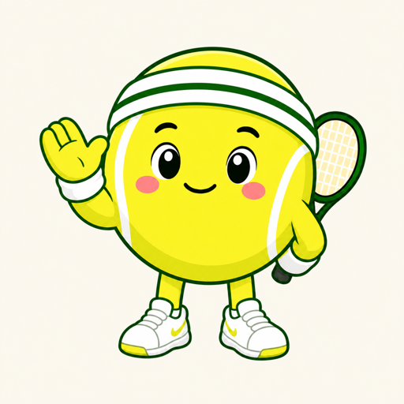

# 一拍一拍｜网球成长伙伴

<p align="center">
  
</p>

一拍一拍是一款面向网球爱好者的微信小程序。它用轻量记录保存每次上场，再根据心情、困扰和网球情境给出克制、具体的回应，帮助用户从单次状态波动中看见长期积累。

**[观看 60 秒产品介绍](https://cloud1-d4g6eixi314155355-1461622651.tcloudbaseapp.com/)**

## 为什么做这个产品

网球初学者经常经历进步缓慢、关键分紧张、双误、动作调整和比赛失利。现有产品通常聚焦运动数据、技术分析或约球社交，却很少处理打完球后的记录、情绪和成长感。

一拍一拍聚焦这个空白：

- 90 秒内完成一次结构化记录，不增加复盘负担
- 用日历、成长时间线和勋章呈现长期积累
- 在具体网球语境中回应，而不是输出空泛安慰
- 对比赛等复杂信息采用按需展开，保持主流程轻量

## 核心产品闭环

```text
记录这一拍
  → 选择打球方式、时间和时长
  → 选择心情与困扰，可选填写日记
  → 匹配一条网球情境回应
  → 记录进入日历、成长时间线、统计和勋章系统
```

## 关键产品判断

### 1. 首版使用受控回应库

首版没有直接接入生成式 AI，而是使用经过逐句审核的受控语料：

1. 根据心情、困扰标签、日记关键词和回应偏好识别情境
2. 从对应语料池中匹配标题、正文和下一步建议
3. 通过历史去重轮换文案，减少连续重复
4. 正向情绪不引入负面推断，负向情绪不做过度心理化解释

这个方案优先保证内容质量、合规边界和低成本验证。后续计划在受控规则之外引入 AI 理解，让回应更个性化，同时保留安全边界。

### 2. 复杂度按需出现

- 日常训练只填写必要信息
- 比赛级别、轮次、名次和比分进入独立选填页面
- 困扰标签只在相关心情下出现
- 网球画像可以跳过，之后再补充

## 已实现功能

- 新用户引导与网球画像
- 拉球、学球、发球机和比赛记录
- 单轮与多轮比赛详情
- 心情、困扰、日记与多风格回应
- 月度及累计打球统计
- 打球日历与历史补记
- 成长时间线及记录修改、删除
- 长期成就、月度挑战与勋章弹窗
- 按比赛级别统计胜负和胜率
- 用户反馈与“删除我的云端数据”
- 微信云开发数据同步及账号隔离

## 技术结构

```text
微信小程序原生框架
├── pages/           页面与交互
├── services/        本地缓存与云数据库统一仓库
├── utils/           日期、勋章、比赛统计和回应规则
├── cloudfunctions/  登录与用户数据删除
├── assets/          拍拍及情绪形象
└── tests/           核心规则、流程与发布前检查
```

在未配置云环境时，项目自动使用微信本地缓存，便于演示和开发；配置云环境后，统一仓库层切换到云数据库。

## 本地运行

1. 安装[微信开发者工具](https://developers.weixin.qq.com/miniprogram/dev/devtools/download.html)
2. 克隆本仓库并在开发者工具中选择“导入项目”
3. 使用自己的小程序 AppID，或保留 `project.config.json` 中的 `touristappid`
4. 直接编译即可体验本地缓存模式

如需接入微信云开发：

1. 创建云开发环境
2. 将环境 ID 填入 `config/env.js`
3. 根据 [`docs/cloudbase-setup.md`](docs/cloudbase-setup.md) 创建集合并部署云函数

## 测试

```bash
npm test
```

测试覆盖核心工具函数、记录闭环、比赛统计、勋章规则、回应匹配和发布前配置检查。

## 产品与交付文档

- [产品需求文档](docs/mvp-prd.md)
- [项目任务流](docs/project-task-flow.md)
- [功能验收清单](docs/functional-qa.md)
- [指标设计](docs/metrics-plan.md)
- [上线前验收记录](docs/prelaunch-qa-2026-08-02.md)

## 项目状态

MVP 已完成，核心流程已通过模拟器与真机验收，目前处于备案和种子用户验证阶段。

本仓库用于产品作品展示与技术交流。生产环境标识、个人配置和用户数据均未包含在公开仓库中。
